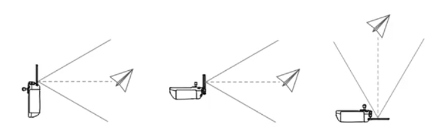

#  《轻型民用无人驾驶航空器安全操控》 - 法规部分 

## 如何定义微型、轻型无人驾驶航空器？

- 微型无人驾驶航空器，是指空机重量小于0.25千克，最大飞行真高不超过50米，最大平飞速度不超过40千米/小时，无线电发射设备符合微功率短距离技术要求，全程可以随时人工介入操控的无人驾驶航空器。
- 轻型无人驾驶航空器，是指空机重量不超过4千克且最大起飞重量不超过7千克，最大平飞速度不超过100千米/小时，具备符合空域管理要求的空域保持能力和可靠被监视能力，全程可以随时人工介入操控的无人驾驶航空器，但不包括微型无人驾驶航空器。

## 什么是空机重量、最大起飞重量？

- 空机重量是指无人驾驶航空器机体、电池、燃料容器等固态装置重量总和，不含填充燃料和任务载荷的重量。
- 最大起飞重量是指根据设计或者运行限制，无人驾驶航空器正常起飞所容许的最大重量。

## 操控民用无人驾驶航空器飞行的人员是否需要取得相关执照？

- 操控微型、轻型民用无人驾驶航空器飞行的人员，无需取得操控员执照，但应当熟练掌握有关机型操作方法，了解风险警示信息和有关管理制度。操控小型、中型、大型民用无人驾驶航空器飞行的人员，应当取得局方规定的相应有效操控员执照，并且在行使相应权利时随身携带该执照。

- 从事常规农用无人驾驶航空器作业飞行活动的人员无需取得操控员执照，但应当由农用无人驾驶航空器系统生产者按照民航局、农业农村部规定的内容进行培训和考核，合格后取得操作证书。

## 无民事行为能力人是否可以操控民用无人驾驶航空器？

无民事行为能力人只能操控微型民用无人驾驶航空器飞行，限制民事行为能力人只能操控微型、轻型民用无人驾驶航空器飞行。无民事行为能力人操控微型民用无人驾驶航空器飞行或者限制民事行为能力人操控轻型民用无人驾驶航空器飞行，应当由熟练掌握有关机型操作方法，了解风险警示信息和有关管理制度的完全民事行为能力人现场指导。

## 什么情况下，无人驾驶航空器操控员需要购买责任保险？

使用民用无人驾驶航空器从事经营性飞行活动，以及使用小型、中型、大型民用无人驾驶航空器从事非经营性飞行活动，应当依法投保责任保险。

## 登记管理具体有哪些要求？ 

1. 民用无人驾驶航空器登记管理包括实名登记和国籍登记； 
2. 在中华人民共和国境内从事飞行以及有关活动的民用无人驾驶航空器，应当依照规定进行实名登记； 
3. 从事境外飞行的民用无人驾驶航空器，应当完成国籍登记、具有国籍标志和登记标志； 
4. 民用无人驾驶航空器不得具有双重国籍，未注销外国国籍的民用无人驾驶航空器不得在中华人民共和国申请国籍登记。未注销中华人民共和国国籍的民用无人驾驶航空器，不得在外国办理国籍登记。

## 操控民用无人驾驶航空器，是否需要实名登记？

在中华人民共和国境内从事飞行以及有关活动的民用无人驾驶航空器，应当依照规定进行实名登记。

## 实名登记需要提供哪些信息？

民用无人驾驶航空器实名登记信息应当包括下列内容： 

1. 所有人合法身份的信息； 
2. 所有人的联系信息； 
3. 民用无人驾驶航空器的信息； 
4. 民用无人驾驶航空器的使用用途。

## 哪些情况下，应当申请注销登记？

取得实名登记的民用无人驾驶航空器，遇有下列情形之一的，应当申请注销登记： 

1. 民用无人驾驶航空器的所有权或者占有权发生变更； 
2. 民用无人驾驶航空器退出使用、报废或者失事； 
3. 民用无人驾驶航空器所有权依法转移境外并已办理出口适航证的。

## 管制空域和适飞空域

民用无人驾驶航空器空域分为民用无人驾驶航空器管制空域（以下简称管制空域）和微型、轻型、小型民用无人驾驶航空器适飞空域（以下简称适飞空域）。

## 什么是管制空域？

真高120米以上空域，空中禁区、空中限制区以及周边空域，军用航空超低空飞行空域，以及下列区域上方的空域应当划设为管制空域： 

1. 机场以及周边一定范围的区域；
2. 国界线、实际控制线、边境线向我方一侧一定范围的区域；
3. 军事禁区、军事管理区、监管场所等涉密单位以及周边一定范围的区域；
4. 重要军工设施保护区域、核设施控制区域、易燃易爆等危险品的生产和仓储区域，以及可燃重要物资的大型仓储区域；
5. 发电厂、变电站、加油（气）站、供水厂、公共交通枢纽、航电枢纽、重大水利设施、港口、高速公路、铁路电气化线路等公共基础设施以及周边一定范围的区域和饮用水水源保护区；
6. 射电天文台、卫星测控（导航）站、航空无线电导航台、雷达站等需要电磁环境特殊保护的设施以及周边一定范围的区域；
7. 重要革命纪念地、重要不可移动文物以及周边一定范围的区域；
8. 国家空中交通管理领导机构规定的其他区域。

## 什么是管制空域？

管制空域的具体范围由各级空中交通管理机构按照国家空中交通管理领导机构的规定确定，由设区的市级以上人民政府公布，民用航空管理部门和承担相应职责的单位发布航行情报。

## 什么是适飞空域？

管制空域范围以外的空域为微型、轻型、小型无人驾驶航空器的适飞空域。

在适飞空域内飞行不需要向空中交通管理机构申请，但需留意当地管理部门的临时性管控，如大型活动、人员密集的景点发布的管理公告等，建议提前向当地了解。

## 什么是飞行真高？

飞行真高：是指民用无人驾驶航空器的飞行高度与其地面投影的实时距离。

## 若在管制空域飞行，如何进行飞行活动申请？

组织无人驾驶航空器飞行活动的单位或者个人应当在拟飞行前1日12时前向空中交通管理机构（即U0M平台）提出飞行活动申请。

空中交通管理机构应当在飞行前1日21时前作出批准或者不予批准的决定。未经空中交通管理机构批准，不得在管制空域内实施无人驾驶航空器飞行活动。

按照国家空中交通管理领导机构的规定在固定空域内实施常态飞行活动的，可以提出长期飞行活动申请，经批准后实施，并应当在拟飞行前1日12时前将飞行计划报空中交通管理机构备案。

微型、轻型、小型无人驾驶航空器在适飞空域内的飞行活动，无需向空中交通管理机构提出飞行活动申请。

## 隔离飞行和融合飞行

- 隔离飞行，是指无人驾驶航空器与有人驾驶航空器不同时在同一空域内的飞行。
- 融合飞行，是指无人驾驶航空器与有人驾驶航空器同时在同一空域内的飞行。

## 哪些情况下，无人驾驶航空器可以与有人驾驶航空器融合飞行？

无人驾驶航空器通常应当与有人驾驶航空器隔离飞行。

属于下列情形之一的，经空中交通管理机构批准，可以进行融合飞行：

1. 根据任务或者飞行课目需要，警察、海关、应急管理部门辖有的无人驾驶航空器与本部门、本单位使用的有人驾驶航空器在同一空域或者同一机场区域的飞行；
2. 取得适航许可的大型无人驾驶航空器的飞行；
3. 取得适航许可的中型无人驾驶航空器不超过真高300米的飞行；
4. 小型无人驾驶航空器不超过真高300米的飞行；
5. 轻型无人驾驶航空器在适飞空域上方不超过真高300米的飞行。

## 微型、轻型无人驾驶航空器在适飞空域内进行融合飞行，是否需要经过空中交通管理机构批准？

不需要。

## 什么是电子围栏？

电子围栏，是指为防止民用无人驾驶航空器飞入或者飞出特定区域，在相应电子地理范围中画出其区域边界，并配合飞行控制系统，保障区域安全的软硬件系统。

## 哪些民用无人驾驶航空器应当安装并使用无人驾驶航空器电子围栏？

1. 小型、中型和大型民用无人驾驶航空器。
2. 在重点地区和机场净空区以下运行的轻型无人驾驶航空器。

## 什么是空域保持能力？

空域保持能力，是指通过电子围栏等技术措施控制无人驾驶航空器的高度与水平范围的能力。

## 操控无人驾驶航空器实施飞行活动，应该遵守哪些行为规范？

1. 依法取得有关许可证书、证件，并在实施飞行活动时随身携带备查；
2. 实施飞行活动前做好安全飞行准备，检查无人驾驶航空器状态，并及时更新电子围栏等信息；
3. 实时掌握无人驾驶航空器飞行动态，实施需经批准的飞行活动应当与空中交通管理机构保持通信联络畅通，服从空中交通管理，飞行结束后及时报告；
4. 按照国家空中交通管理领导机构的规定保持必要的安全间隔；
5. 操控微型无人驾驶航空器的，应当保持视距内飞行；
6. 操控小型无人驾驶航空器在适飞空域内飞行的，应当遵守国家空中交通管理领导机构关于限速、通信、导航等方面的规定；
7. 在夜间或者低能见度气象条件下飞行的，应当开启灯光系统并确保其处于良好工作状态；
8. 实施超视距飞行的，应当掌握飞行空域内其他航空器的飞行动态，采取避免相撞的措施；
9. 受到酒精类饮料、麻醉剂或者其他药物影响时，不得操控无人驾驶航空器；
10. 国家空中交通管理领导机构规定的其他飞行活动行为规范。

## 对于无人驾驶航空器操控员，关于酒精和药物的限制是如何定义的？

1. 操控员在饮用任何含酒精饮料之后的8小时之内或者处在酒精作用之下，血液中酒精含量等于或者大于0.04%，或者受到任何药物影响损及工作能力时，不得担任民用无人驾驶航空器操控员。
2. 操控员应当按照局方的要求接受酒精或者药物检验或者提供检验结果。

## 操控无人驾驶航空器实施飞行活动，应当遵守哪些避让规则？

1. 避让有人驾驶航空器、无动力装置的航空器以及地面、水上交通工具；
2. 单架飞行避让集群飞行；
3. 微型无人驾驶航空器避让其他无人驾驶航空器；
4. 民用无人驾驶航空器之间，以及民用无人驾驶航空器与有人驾驶航空器之间应当按照局方要求保持飞行间隔，并遵守相应的避让规则。

## 无人驾驶航空器操控员的哪些行为可能会收到处罚？

1. 对已经取得适航许可的民用无人驾驶航空器系统进行重大设计更改，未重新申请取得适航许可并将其用于飞行活动的，由民用航空管理部门责令改正，处无人驾驶航空器系统货值金额1倍以上5倍以下的罚款；
2. 改变微型、轻型、小型民用无人驾驶航空器系统的空域保持能力、可靠被监视能力、速度或者高度等出性能以及参数，未及时在无人驾驶航空器一体化综合监管服务平台更新性能、参数信息的，由民用航空管理部门责令改正；拒不改正的，处2000元以上2万元以下的罚款；
3. 民用无人驾驶航空器未经实名登记实施飞行活动的，由公安机关责令改正，可以处200元以下的罚款；情节严重的，处2000元以上2万元以下的罚款；
4. 涉及境外飞行的民用无人驾驶航空器未依法进行国籍登记的，由民用航空管理部门责令改正，处1万元以上10万元以下的罚款；
5. 民用无人驾驶航空器未依法投保责任保险的，由民用航空管理部门责令改正，处2000元以上2万元以下的罚款；情节严重的，责令从事飞行活动的单位停业整顿直至吊销其运营合格证。
6. 未取得运营合格证或者违反运营合格证的要求实施飞行活动的，由民用航空管理部门责令改正，处5万元以上50万元以下的罚款；情节严重的，责令停业整顿直至吊销其运营合格证；
7. 无民事行为能力人、限制民事行为能力人违反本条例规定操控民用无人驾驶航空器飞行的，由公安机关对其监护人处500元以上5000元以下的罚款；情节严重的，没收实施违规飞行的无人驾驶航空器；
8. 未取得操控员执照操控民用无人驾驶航空器飞行的，由民用航空管理部门处5000元以上5万元以下的罚款；情节严重的，处1万元以上10万元以下的罚款；
9. 超出操控员执照载明范围操控民用无人驾驶航空器飞行的，由民用航空管理部门处2000元以上2万元以下的罚款，并处暂扣操控员执照6个月至12个月；情节严重的，吊销其操控员执照，2年内不受理其操控员执照申请；
10. 外国无人驾驶航空器或者由外国人员操控的无人驾驶航空器在我国境内实施测绘飞行活动的，由县级以上人民政府测绘地理信息主管部门责令停止违法行为，没收违法所得、测绘成果和实施违规飞行的无人驾驶航空器，并处10万元以上50万元以下的罚款；情节严重的，并处50万元以上100万元以下的罚款，由公安机关、国家安全机关按照职责分工决定限期出境或者驱逐出境。
11. 非法拥有、使用无人驾驶航空器反制设备的，由无线电管理机构、公安机关按照职责分工予以没收，可以处5万元以下的罚款；情节严重的，处5万元以上20万元以下的罚款；
12. 未经批准操控微型、轻型、小型民用无人驾驶航空器在管制空域内飞行，或者操控模型航空器在空中交通管理机构划定的空域外飞行的，由公安机关责令停止飞行，可以处500元以下的罚款；情节严重的，没收实施违规飞行的无人驾驶航空器，并处1000元以上1万元以下的罚款。

# 《轻型民用无人驾驶航空器安全操控》 - 多旋翼部分 

## 多旋翼民用无人驾驶航空器螺旋桨的作用

螺旋桨为多旋翼民用无人驾驶航空器提供升力，多旋翼民用无人驾驶航空器通过飞控系统控制电机调节螺旋桨转速，来实现飞行。

## 多旋翼民用无人驾驶航空器天线的作用

多旋翼民用无人驾驶航空器的图像传输以及遥控控制信号，主要是通过无线信道进行的，靠民用无人驾驶航空器与遥控器的天线传输。所以，一定要避免在高压线、通讯基站或发射塔等区域飞行，以免无线通信信号受到干扰。

## 多旋翼民用无人驾驶航空器中的图传是什么？

图传是图像传输技术和装置，是指将图像信息通过无线电波或有线电缆等方式传输到远程设备上，实现图像的监控、传输和存储。图传的原理是将摄像头采集到的图像数据进行编码压缩，然后通过无线电波或有线电缆传输到接收端。在接收端，解码器将接收到的数据解码还原成原始图像，再通过显示器或其他设备进行显示或存储。

## 在操作多旋翼民用无人驾驶航空器时，如何保证图传传输距离足够远？

多旋翼民用无人驾驶航空器通过无线图传模块进行无线通信，无线电磁波采用直线传输，类似光线传输效果。所以，障碍物的阻挡对无线图传模块进行无线传输有着巨大的影响。如果发射和接收相对的方向有很多障碍物，无线传输的信号就几乎没有穿透的可能，就算能穿透，信号也非常弱。因此，在障碍物较少的远郊野外、开阔农田环境下，多旋翼民用无人驾驶航空器的图传距离相对远。

## 多旋翼民用无人驾驶航空器遥控器摇杆的作用

遥控器摇杆主要用于实时控制民用无人驾驶航空器的高度、方向和速度等飞行状态。

## 常见的多旋翼民用无人驾驶航空器机头指示灯、状态指示灯的作用

- 航空器机头LED指示灯用于指示机头方向；
- 状态指示灯指示当前飞控系统的状态。

## 多旋翼民用无人驾驶航空器视觉系统的作用

当光照等环境条件满足视觉系统需求时，可利用视觉系统定位实现悬停，视觉系统还可通过图像测距来感知障碍物实现避障。

## 多旋翼民用无人驾驶航空器云台相机的作用

云台相机是多旋翼民用无人驾驶航空器的常见负载，其作用是让民用无人驾驶航空器在高速飞行的状态下，也能获取稳定的
影像。

## 在常见的多旋翼民用无人驾驶航空器中返航按键的作用

常见的多旋翼民用无人驾驶航空器都配置有返航按键，其作用是启动或取消返航，启动后民用无人驾驶航空器将返航至最新
记录的返航点。

## 多旋翼民用无人驾驶航空器遥控器云台俯仰控制拨轮的作用

通过拨动多旋翼民用无人驾驶航空器遥控器云台俯仰控制拨轮，可以调节云台俯仰角度。

## 多旋翼民用无人驾驶航空器遥控器录像按键、拍照按键的作用

遥控器录像按键可以控制相机开始或停止录像；拍照按键可以控制相机拍摄照片。

## 相对高度、海拔高度是指什么？

通常所说的相对高度是指民用无人驾驶航空器相对起飞点的高度。海拔高度是指其当前飞行的海拔高度。

## 在常见的多旋翼民用无人驾驶航空器中，朝向一般指什么？

通常所说的多旋翼民用无人驾驶航空器朝向，是指其机头的朝向。

## 在常见的多旋翼民用无人驾驶航空器中，失联（控）行为是指什么？

失联（控）行为是指，当民用无人驾驶航空器与遥控器失去信号、断开连接后，民用无人驾驶航空器执行的飞行动作。

## 在常见的多旋翼民用无人驾驶航空器中，返航高度是指什么？

返航高度即指民用无人驾驶航空器返航设定的高度。

## 什么是ADS-B系统？

ADS-B(Automatic Dependent Surveillance-Broadcast)中文名称为广播式自动相关监视，是一种基于全球卫星定位系统和利用空地、空空数据链实现交通监控和信息传递的空管监视新技术。该技术能够实现飞行信息共享、装备了此系统的飞机可通过数据链广播其自身的精确位置和其他数据、可接收其他飞机通过此系统广播的位置等信息，但不可对民用无人驾驶航空器的刹停进行控制。

## 什么是GNSS?

GNSS是全球导航卫星系统(Global Navigation Satellite System)的简称，包括中国北斗卫星导航系统(BDS)、美国全球定位系统(GPS)、俄罗斯格洛纳斯全球导航卫星系统(GLONASS)、欧盟伽利略卫星导航系统(GALILEO),该系统可以让多旋翼民用无人驾驶航空器实时定位，进而实现悬停、稳定飞行。

## 当多旋翼民用无人驾驶航空器GNSS信号弱时，会产生的影响有

GNSS系统的关键是实现对卫星信号的接收和解析，其中信号跟踪是关键技术之一。然而，在某些条件下，例如高纬度地区、城市高层建筑密集区域、层流云天气等情况下，GNSS信号可能会变弱，进而导致定位效果变差。

在GNSS信号欠佳但环境光照充足的情况下，视觉系统可为民用无人驾驶航空器提供定位及环境感知能力，帮助民用无人驾驶航空器实现稳定悬停。

## 什么是RTK?

RTK的全称是实时动态测量技术，是测量技术发展里程中的一个突破，它由基准站接收机、数据链、流动站接收机三部分组成。RTK实时差分定位是一种能够在野外实时得到厘米级定位精度的测量方法，它的出现极大地提高了野外作业效率。双RTK天线通过同时使用两个不同频率的载波信号来测量载波相位差，从而提高定位精度和抗电磁干扰能力。RTK的精度误差会随基准站与流动站的空间距离的增加而迅速降低，同时还受到电离层及大气层对定位精度的影响。

## 多旋翼民用无人驾驶航空器指南针的作用

指南针模块是测量地球磁场方向，从而提供民用无人驾驶航空器的航向信息。

## 常见多旋翼民用无人驾驶航空器的自动返航功能是指什么？什么是返航点？

- 当自动返航功能触发时，民用无人驾驶航空器将自主返回最新一次记录的返航点；
- 返航点在一般情况下是指，当GNSS信号首次显示为强或较强时，所记录当前位置为返航点。

## 多旋翼民用无人驾驶航空器电池能量的单位是？

电池的额定能量通常以瓦时(Wh)为单位，指电池可以释放出1瓦电力进行消耗1小时。电池的额定能量越高，其续航能力就越强。

## 多旋翼民用无人驾驶航空器电池容量的单位是？

电池容量是指电池存储电量的大小，是衡量电池性能的重要标志之一，它表示在一定条件下电池放出的电量，其单位是毫安时(mAh)。
多旋翼民用无人驾驶航空器电池存储自放电保护是指？

自放电保护是对满电电池长时间存储的一种保护措施，一般满电电池在无任何操作若干天后，电池将放电至60%左右存储。

## 多旋翼民用无人驾驶航空器电池的平衡保护是指？

电池的平衡保护是指能够自动平衡电池内部电芯电压，以保护电池。

## 多旋翼民用无人驾驶航空器电池的充电温度保护是指？

一般多旋翼民用无人驾驶航空器电池在5°℃以下或40°℃以上时充电会损坏电池，在此温度时电池将不启动充电。

## 多旋翼民用无人驾驶航空器常用的通信频段是？

一般多旋翼民用无人驾驶航空器通常工作在5.8GHz和2.4GHz两个通信频段，并可智能切换。

## 在多旋翼民用无人驾驶航空器飞行前，为了保证安全需要做哪些准备工作？ 

1. 《无人驾驶航空器飞行管理暂行条例》于2024年1月1日正式实施，为了保证飞行安全，飞行前务必查询并遵守相关法律法规；
2. 起降点务必选择远离人群的空旷环境；
3. 在使用航空器飞行前，最好参加飞行培训课程，或者使用飞行模拟器进行虚拟飞行练习；
4. 起飞前务必等待航空器获取良好的GNSS信号后再起飞，当航空器与遥控器断联后，航空器能自动返航至起飞点；
5. 飞行前，一定要提前查看飞行区域的限飞禁飞情况，务必做到合法飞行；
6. 大风、雨雪、大雾等天气不适合航空器飞行，因此要提前查看天气情况，确保飞行安全；
7. 飞行前，仔细检查航空器的机身、电机、电池、桨叶、遥控器等部件是否有污损，以及检查飞行软件中与操控、安全相关的设置项是否设置正确。

## 多旋翼民用无人驾驶航空器的飞行安全注意事项主要有哪些？

1. 应确保已经对航空器有足够程度的了解，并清楚所有的紧急返航措施；
2. 每次飞行前，应当准备好飞行计划，请勿鲁莽、即兴、随意操控航空器飞行；
3. 应当熟练掌握有关机型操作方法，了解风险警示信息和有关管理制度；
4. 停止使用发生事故（例如碰撞、倾覆等）或飞行状态异常的航空器；
5. 使用时，禁止向建筑物、人群或动物投掷、发射任何危险物体；
6. 若有必要可安排观察员帮助您监控航空器位置；
7. 禁止操控航空器在超过限定高度的空域飞行；
8. 禁止操控航空器在未经允许的情况进入法律法规规定的禁飞区和敏感建筑设施附近；
9. 禁止使用航空器搭载任何违法危险物品；
10. 切勿在载人飞机附近飞行，必要时应立即降落。

## 多旋翼民用无人驾驶航空器的起飞场所有哪些注意事项？

1. 应将航空器放置在平整开阔的地面，并保持对尾起飞，对尾是指航空器尾部与操控员相对，即航空器机头朝向与操控员朝向一致；
2. 为了飞行安全以及能获得良好的GNSS信号，飞行场地应该选择开阔、周围无高大建筑环境，并避免在人群稠密区飞行；
3. 切不可在易燃易爆的环境中使用多旋翼民用无人驾驶航空器；
4. 请勿在有高压线，通讯基站或发射塔等区域飞行，以免遥控器受到干扰；
5. 切勿选择在密集人群中起飞，容易发生安全事故；
6. 切勿在手掌上起飞航空器。

## 多旋翼民用无人驾驶航空器的飞行前检查，有哪些注意事项？

1. 折叠型航空器务必展开机臂后再开始飞行；
2. 开启航空器电源之前，确保保护罩已移除以免影响航空器自检；
3. 飞行前，一定要事先确认电池电量，防止电量不足引起的安全隐患；
4. 请检查螺旋桨是否安装正确和紧固；
5. 请务必检查各螺旋桨是否完好，如有老化、破损或变形，请更换后再飞行；
6. 检查遥控器的操控方式是否为自己常用的方式；
7. 如发现机身视觉传感器有污渍，可使用干净毛巾擦拭，但切不可用水冲洗航空器及电池；
8. 确认开机后电机是否能正常启动；
9. 为了保证航空器的安全稳定性能，不可自行改装电机等部件的物理结构；
10. 相机云台能为操控员提供清晰稳定的图传画面，如相机云台工作异常，也会影响飞行安全。

## 多旋翼民用无人驾驶航空器螺旋桨使用有哪些注意事项？

1. 部分航空器螺旋桨有正反桨之分，安装时需要将桨叶安装至对应的电机桨座上，并确保安装牢固，否则可能会引发飞行安全事故；
2. 航空器电机停止转动前，切不可用手抓旋转的螺旋桨，否则桨叶可能会割伤手指；
3. 由于桨叶较薄，请小心操作以防意外划伤；
4. 不可混用不同型号的螺旋桨；
5. 收纳时，请根据收纳包结构正确放置航空器，错误放置将会挤压螺旋桨，导致螺旋桨变形动力性能下降；
6. 螺旋桨如有老化、破损或变形，请更换后再飞行。

## 多旋翼民用无人驾驶航空器遥控器使用注意事项

1. 遥控器天线影响航空器的图像传输以及遥控控制信号，因此如遥控器天线损坏，要及时返修，否则可能会影响使用性能；
2. 每次飞行前，确保遥控器电量充满；
3. 每隔3个月左右重新给遥控器充电一次以保持电池活性；
4. 如更换遥控器，需要重新对频才能使用；
5. 操控航空器飞行时，应展开遥控器天线，调整天线位置以确保航空器总是位于最佳通信范围内。当天线与遥控器背面呈现180°或270°夹角时，且天线平面正对航空器，可让遥控器与航空器的信号质量达到最佳状态，如下图所示。

## 多旋翼民用无人驾驶航空器飞行操作有哪些注意事项？

1. 检查完航空器后再开启遥控器和航空器电源；
2. 把航空器放置在平整开阔地面上，面朝机尾；
3. 飞行前先观察飞行环境，确定无障碍物之后再飞行，同时还要注意天气变化；
4. 请勿将航空器手持在掌上起飞或降落，以免桨叶割伤手部；
5. 等待航空器自检完成并设置合理返航高度，无异常提示即可启动电机；
6. 操控航空器时，应该缓慢轻推上升下降摇杆，让航空器匀速平稳起飞；
7. 航空器电机启动后，应悬停至2米以上，等待GNSS信号良好并刷新返航点后再飞行；
8. 飞行过程中时刻关注当前航空器及遥控器电量情况，当电量提示不足时立即进行返航；
9. 及时调整遥控器与航空器间的方位和距离，以及调整天线位置以确保航空器始终处于最佳通信范围内；
10. 操控航空器飞行时，不应进行极限操作，而应尽量匀速平稳操作，并留有足够的返航电量；
11. 操控员在操控航空器飞行时，应既关注遥控器图传画面，又观察飞行环境。在操控侧飞或倒飞时，因无法从图传画面中查看环境情况，请务必谨慎小心，切勿盲目侧飞倒飞，防止撞到障碍物；
12. 飞行过程中请勿接打电话、发送短信，或其他干扰操控的操作；
13. 注意躲避细小和透明障碍物，如小鸟、风筝线、树枝、玻璃墙面，且不要贴近水面飞行；
14. 航空器电机启动状态下，螺旋桨高速转动，此时切勿靠近，防止被桨叶割伤；
15. 航空器的视觉避障只有在光照等环境条件满足视觉系统工作要求时才能生效，光照条件特别暗或者特别亮的情况下，请谨慎飞行，即使视觉系统正常工作时，也可能无法精准识别高压线，而且高压线还会影响图传和遥控信号，因此不建议在高压线间飞行，如因电力巡检等工作原因必须在此环境下飞行，建议经专门培训后再进行操作；
16. 应尽量避免在人群密集区域内飞行；
17. 航空器落地后，等待电机完全停止转动后才可关闭遥控器电源，否则航空器可能判断为与遥控器断联，执行自动返航。

## 为什么多旋翼民用无人驾驶航空器在夏季飞行时禁止在飞行结束后立刻充电？

多数航空器电池温度在5℃以下或40℃以上时充电会损坏电池，夏季飞行结束后，电池温度可能会超过40°℃，因此禁止在飞行结束后立刻给电池充电。

## 多旋翼民用无人驾驶航空器在高原地区飞行时，为保证操作的稳定性，有哪些注意事项？

1. 不同型号的航空器都有最大起飞海拔高度限制，当在高原地区飞行时，其续航和稳定性能都会受到影响，因此应尽量减少载重，缓慢飞行；
2. 应更换高原专用螺旋桨飞行。

## 多旋翼民用无人驾驶航空器在山区飞行时有哪些注意事项？

1. 山体容易阻挡信号传输，山体之间还可能形成乱流，影响飞行安全，因此应减少在山区飞行的时间；
2. 确保航空器与障碍物保持一定的距离；
3. 尽量在视距内飞行；
4. 必要时增加飞行高度以获得更好的信号；
5. 在山区飞行时，飞行环境复杂，应开启航空器的避障系统，保证飞行安全；
6. 矿山等磁场环境会干扰航空器的指南针模块，导致航空器无法准确获取航向信息。

## 多旋翼民用无人驾驶航空器在低温环境下飞行时有哪些注意事项？

1. 在低温环境飞行时，电池放电能力减弱，飞行前务必保证电池满电，并建议将电池预热；
2. 电池工作在低温环境下放电能力将降低，请先将航空器悬停1mi左右以加热电池；
3. 低温环境下航空器电池输出功率受限，抗风能力也相应减弱；
4. 应注意观察环境，确保在没有大风和雨雪天气下飞行，降落时避免电池接触到冰雪，防止损坏电路。

## 多旋翼民用无人驾驶航空器指南针校准及注意事项

当航空器提示指南针异常，或飞行场地与上一次指南针校准的场地相距较远，应进行指南针校准。注意事项如下：

1. 校准时请勿随身携带铁磁物质，如手机等；
2. 指南针校准成功后，将航空器放回地面时再次提示需要校准，请转移至其他位置再次校准后飞行；
3. 磁矿、停车场、带有地下钢筋的建筑区域可能会影响指南针校准的成功率，如指南针校准多次失败，请转移至其他位置再次校准后飞行。

## 在多旋翼民用无人驾驶航空器中，姿态模式是指什么？

1. 在GNSS卫星信号差或者指南针受干扰、并且不满足视觉定位工作条件时，航空器将进入姿态模式；
2. 在姿态模式下，航空器将在水平方向产生漂移，无法实现定点悬停以及自主刹车，应尽快降落到安全位置以避免发生事故。

## 多旋翼民用无人驾驶航空器通常在遇到什么情况下会触发自动返航功能？

当航空器记录了返航点并且在定位服务良好的情况下，航空器电池电量不足、遥控器与航空器之间失去通讯信号以及图传信号丢失时，将会触发自动返航，操控员也可主动开启自动返航，航空器将自动返回返航点并降落。

## 多旋翼民用无人驾驶航空器如何设置合理返航高度？

在航空器执行返航命令前，操控员可在飞行软件中设置返航高度，返航高度应高于周围最高建筑物的高度。

多旋翼民用无人驾驶航空器返航功能注意事项

1. 如果航空器在没有获取足够的GNSS信号、没有刷新返航点时就起飞，而是在飞行过程中刷新了返航点，那么航空器返航时将返回至刷新返航点的位置并降落，不会返回至航线起始点。因此，每次飞行前请确认航空器获取足够GNSS信号、刷新返航点后再飞离，这样航空器返航时才能返回航线起始点并降落；
2. 常见的航空器可手动设置刷新返航点，遥控器信号正常时，在返航过程中可通过遥控器手动辅助控制航空器；
3. 航空器返航时，视觉系统可能无法识别和躲避电线、电塔、小树枝等障碍物，在紧急情况下停止返航并手动控制航空器，另外，风速过大时，可能导致航空器无法成功返航，请谨慎飞行；
4. 如果返航时电量不足，最好观察飞行环境，如返航路径上没有高大障碍物，可适当降低飞行高度，边降落边返回，保持快速且匀速返航；
5. 当航空器电池电量过低、没有足够的电量返航时，应尽快降落，否则电量耗尽时将会直接坠落，导致航空器损坏或者引发其他危险。

## 多旋翼民用无人驾驶航空器信号中断后的注意事项

1. 如果航空器遥控器信号中断，请勿胡乱打杆，应及时调整天线指向，尝试重新获取信号。若航空器具有自动返航功能，可在返航点位置等待返航；
2. 如果航空器遥控器图传信号中断，但遥控器的数据信号没有中断还能回传飞行数据，此时应开启自动返航功能，等待航空器返航。或者通过飞行地图观察航空器位置和朝向信息后手动操控返航，切不可继续随意飞行。

## 多旋翼民用无人驾驶航空器在飞行途中遇到大风的注意事项

如果航空器在飞行途中遇到大风，此时应降低飞行高度，尽快操控返航，如风力过大航空器无法返航，应尽快在合适地点降落，再及时前往寻找，切不可继续飞行作业。

## 多旋翼民用无人驾驶航空器视觉系统的注意事项

1. 航空器视觉系统，是通过图像测距来感知障碍物，为航空器提供定位及环境感知能力，但在能见度低、水面或者透明物体表面、没有纹理特征的表面、光照强度不足或过强的工作场景下，视觉系统可能无法正常工作，因此夜间飞行时请格外谨慎小心；
2. 航空器视觉系统只在有限条件下发挥安全辅助作用，不能完全代替人的判断和操控，因此飞行时要保持全程控制，并根据周围环境进行合理判断，不过度依赖视觉系统，应避免在雨雾天气或在其他能见度低的场景飞行；
3. 光照剧烈快速变化的场景，也会影响航空器视觉系统正常工作。

## 多旋翼民用无人驾驶航空器电池相关注意事项

1. 在安装或拔出航空器电池前，应该先关闭电池电源；
2. 给航空器充电时，电池或电池箱应放置在干燥、没有易燃物的环境；
3. 一般航空器电池，推荐在-10C到50C温度范围内使用，电池环境温度超过60C时，可能会导致电池膨胀、无法充电，且会缩减电池寿命；
4. 相较而言，15°℃至40°℃的充电环境温度可延长航空器电池的使用寿命；
5. 如果航空器电池内部液体，不慎溅射到人体皮肤或者眼晴，应立即用清水冲洗至少15分钟，并立即就医；
6. 如果电池从航空器上摔落或受到外力撞击，不可再次使用；
7. 禁止在强静电或者磁场环境中使用电池，否则，电池保护板将会失灵，从而导致航空器发生严重故障；
8. 如果航空器不慎坠入水中，可能会引起电池电路损坏，不应再继续使用；
9. 在使用双电池的航空器时，使用前，请对两块电池进行标记，确保两块电池同时进行充/放电使用，以获得最佳性能。每次飞行前，应确保两个电池均充满电，如两个电池电量有较大差异时，不可起飞；
10. 航空器电池不可接触任何液体，也禁止以任何方式拆解或用尖利物体刺破电池，更不可将电池放置于微波炉或压力锅中加热，否则，将会引起电池着火甚至爆炸；
11. 如果发现航空器电池存在鼓包、漏液情况，严禁使用； 
12. 应定期检查电池健康状况，避免过度充电或放电，长期不使用时，建议在电量40%~60%间进行存储，同时每隔3个月左右重新充放电一次以保持电池活性，这样也能延长航空器电池的使用寿命；
13. 航空器电池如需长期存放，应将电池从航空器内取出；
14. 航空器电池里面的芯片和电芯都存在微小的自耗电，将导致电池在未使用情况下，其电量也在逐步减少；
15. 禁止将电池放在靠近热源的地方，比如阳光直射或热天的车内、火源或加热炉内；
16. 应避免与眼镜、手表、金属项链、发夹或者其他金属物体一起贮存或运输，防止短路。

## 多旋翼民用无人驾驶航空器电池运输注意事项

1. 根据中国民用航空局《关于民航旅客行李中携带锂电池规定的公告》中的规定，可以作为手提行李携带含不超过100Wh锂电池的笔记本电脑、手机、照相机、手表等个人自用便携式电子设备及备用电池登机。经航空公司批准，可以携带含超过100Wh但不超过160Wh锂电池的电子设备登机。每位旅客携带此类备用电池不能超过两个，且不能托运。禁止携带或托运超过160Wh的大型锂电池或电子设备；
2. 切勿运输有破损的电池；
3. 需要运输电池时，将电池放电至20%至30%左右电量，并将电池从充电设备和航空器中取出，避免电池在运输中异常脱落，或造成连接器磨损。

## 多旋翼民用无人驾驶航空器作业完成后需要开展哪些例行检查

1. 目视及触摸检查螺旋桨、机臂、起落架是否完好，有裂纹或者有破损需及时更换；
2. 检查各个连接部件螺丝是否锁紧；
3. 检查桨叶有无明显变形、破损、老化变软等异常现象，如有请更换后再使用；
4. 检查航空器的电池接口有无异物、变形，如有应立即清理或返修，否则可能会影响安全使用；
5. 检查电池外壳是否有明显损伤，有明显损伤的电池禁止用于飞行；
6. 手动转动电机，检查安装是否牢固、有无虚位、旋转是否顺畅无异响；
7. 检查遥控器摇杆是否在中位，摇杆是否有沙土等异物进入；
8. 检查遥控器屏幕是否清洁无水渍、异物等，如有使用无尘布擦拭干净；
9. 检查视觉系统是否有水滴、指纹、脏污等，如有使用无尘布擦拭干净；
10. 检查负载镜头有无异物或脏污，如有请及时清理。

## 多旋翼民用无人驾驶航空器长期存放注意事项

1. 在存储前，应清理机身异物；
2. 航空器长期存放时，建议将桨叶拆除后，放置于干燥通风的环境进行保存，以免电子部件老化、腐蚀生锈等情况；
3. 避免在强磁环境下存储，否则电磁脉冲可能会干扰航空器机载设备，导致系统工作失常，严重时甚至会导致元器件暂时失效或烧毁；
4. 确保电池电量在40%~60%左右，存放在25°℃左右、阴凉、干燥环境，不可在太阳光直晒的地方长期存放；
5. 建议每隔2~3个月左右对电池进行充放电，以保证电池活性。

## 多旋翼民用无人驾驶航空器遥控器摇杆回中是指什么？

摇杆回中是指遥控器的摇杆处于中间位置，也叫中位。

## 多旋翼民用无人驾驶航空器遥控器摇杆杆量是指什么？

摇杆杆量是指遥控器摇杆偏离摇杆中位的偏移量，杆量越大，偏移越多。

## 多旋翼民用无人驾驶航空器升降操控

航空器起飞时，必须将升降摇杆往上推过中位，飞机才能离地起飞，然后缓慢推杆，以防飞行器突然急速上冲。往上推升降摇杆，航空器升高；往下拉升降摇杆，航空器降低。升降摇杆中位时，航空器的高度保持不变。

## 多旋翼民用无人驾驶航空器转向操控

转向杆用于控制航空器航向。往左打转向杆，航空器逆时针旋转，往右打转向杆，航空器顺时针旋转。摇杆杆量对应航空器旋转的速度，杆量越大，旋转的速度应越大。

## 多旋翼民用无人驾驶航空器前后操控

往上推前后杆，航空器向前倾斜，并向前飞行；往下拉前后杆，航空器向后倾斜，并向后飞行。前后杆中位时航空器的前后方向保持水平。上下推杆，摇杆杆量对应航空器前后倾斜的角度，杆量越大，倾斜的角度越大，飞行的速度也越快。

## 多旋翼民用无人驾驶航空器左右操控

往左打左右摇杆，航空器向左倾斜，并向左飞行；往右打左右摇杆，航空器向右倾斜，并向右飞行。左右摇杆中位时航空器的左右方向保持水平。左右推杆，摇杆杆量对应航空器左右倾斜的角度，杆量越大，倾斜的角度越大，飞行的速度也越快。

## 多旋翼民用无人驾驶航空器对频操控

对频是指将航空器与遥控器建立连接。一般情况下，新购买的多旋翼民用无人驾驶航空器已经完成与遥控器的对频工作。并不是任意一个遥控器都可以与航空器进行对频，需先确认遥控器和航空器型号是否支持对频，部分遥控器仅支持特定型号的航空器。

## 多旋翼民用无人驾驶航空器遥控器使用

操控多旋翼民用无人驾驶航空器时，应及时调整遥控器与航空器之间的方位与距离，以及调整天线位置以确保航空器总是位于最佳通信范围内。天线平面正对航空器，可让遥控器与航空器的信号质量达到最佳状态。请勿同时使用其他同频段的通信设备，以免对遥控器信号造成干扰。不可使用金属覆盖遥控器和天线，否则发射信号极容易受到干扰，发射的数据信号会在接收端丢失
